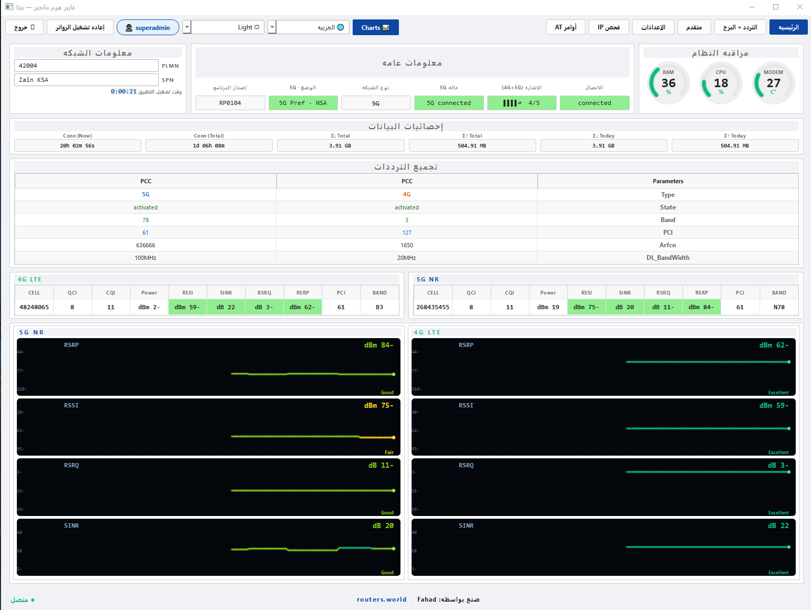
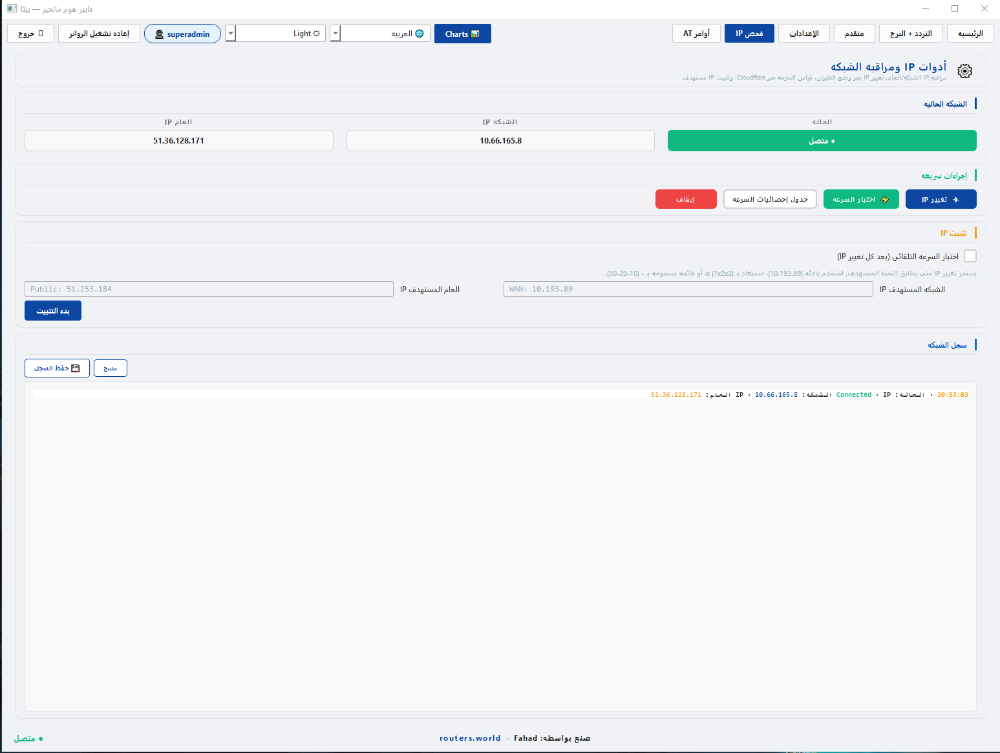

<div align="center">

# FiberHome Manager — Beta

**A modern desktop control panel for the FiberHome LG6851F 5G router.**
*Replaces the slow web UI at `192.168.8.1` with a fast, real-time native app.*

[](https://www.python.org/)
[](https://riverbankcomputing.com/software/pyqt/)
[](#)
[](#license)

</div>

---

<div dir="rtl" align="right">

## 🌍 العربي

برنامج **فايبر هوم مانجير** (تجريبي) — حطيت بعض الأشياء لتسهيل الاستخدام، أتمنى يعجبكم.

<div align="center">





</div>

### وش يسوي؟

<table dir="rtl">
<tr><th>الصفحه</th><th>المحتوى</th></tr>
<tr><td><b>Main</b></td><td>قراءات لحظيه (RSRP/RSRQ/SINR/RSSI) للـ 4G والـ 5G · رسوم بيانيه ملوّنه · جدول CA · إحصائيات الانترنت · حاله الجهاز</td></tr>
<tr><td><b>Band</b></td><td>قفل ترددات LTE/NR متعدّده — تختار الباندات وتطبّق</td></tr>
<tr><td><b>Neighbour Cells</b></td><td>🆕 جدول لحظي للأبراج المجاوره (PCI · EARFCN · RSRP · SINR ملوّنه حسب الإشاره) + زر <b>قفل</b> لكل صف يضيف البرج لقائمه Cell Lock مباشره — كل شي من نفس الصفحه</td></tr>
<tr><td><b>Advance</b></td><td>وضع الطيران بضغطه · Network Mode + 5G Option · التجوال · Carrier Aggregation · هوائي 5G خارجي · SMS · VoLTE · حد بيانات يومي/شهري</td></tr>
<tr><td><b>Settings</b></td><td>LAN/IPv4 · Wi-Fi (SSID-1/2) · Firewall · ALG + UPnP · TR-069/ACS · تغيير باسوورد المشرف · إعاده تشغيل / Factory Reset</td></tr>
<tr><td><b>IP Scan</b></td><td>مراقبه WAN و Public IP لحظياً · تغيير الـ IP عن طريق وضع الطيران · Speed Test مخفي يجيب الأرقام من Fast.com · IP Pinning بأنماط · جدول السرعات</td></tr>
<tr><td><b>AT Command</b></td><td>ترسل أوامر AT للموديم مباشره + 11 أمر جاهز (ATI, AT+CSQ, AT+QENG, ...)</td></tr>
</table>

**فوق هذا كله**:
- 🌗 ثلاث ثيمات: Light · Dark (Tokyo Night) · Aurora — تبديل لحظي
- 🌐 لغتين: عربي / إنجليزي — مع RTL تلقائي
- 🔐 يحفظ بيانات الدخول ويفتح تلقائي مره ثانيه
- 📋 يسجّل كل خطوه في ملف log عشان لو صار شي تعرف وش حصل
- ✅ فحص للنظام أول مره (يتأكد إن كل شي تمام)
- 📊 الواجهه الرئيسيه أفقيه — تشتغل على شاشه 720p بدون مشاكل

### تشتغل على وش؟

<table dir="rtl">
<tr><th>المتطلّب</th><th>المستخدم العادي</th><th>اللي يبني الكود</th></tr>
<tr><td>Windows 10 / 11 (x64)</td><td>✅</td><td>✅</td></tr>
<tr><td>Microsoft Visual C++ 2015–2022 Redistributable</td><td>✅ (الـ Preflight ينزّله تلقائي لو ناقص)</td><td>✅</td></tr>
<tr><td>متصل بالرواتر (LAN أو Wi-Fi)</td><td>✅</td><td>—</td></tr>
<tr><td>Python 3.10+</td><td>❌ ما تحتاجه</td><td>✅</td></tr>
<tr><td>PyQt5 / PyQtWebEngine / websocket-client</td><td>❌ كله جوّه الـ exe</td><td>يثبّتها <code>build.bat</code></td></tr>
<tr><td>متصفّح (Edge/Chrome)</td><td>❌ ما تحتاجه — Qt جايب Chromium معاه</td><td>—</td></tr>
</table>

### كيف تبني الـ exe؟

دبل-كليك على:

```cmd
build.bat
```

السكربت يتحقق من بايثون + pip + الملفات + المكتبات + يبني الـ exe — كل شي تلقائي.

النتيجه في `dist\FiberHome Manager - Beta\` — انسخ المجلّد كله للتوزيع (~266 MB لأنه ضامّن Chromium جوّاه).

### يدوي (لو ما اشتغل السكربت)

```cmd
pip install -r requirements.txt
pip install pyinstaller
pyinstaller FiberHomeManager.spec --noconfirm
```

</div>

---

## 🌐 English

### Overview

**FiberHome Manager** is a desktop control panel for the **FiberHome LG6851F** 5G router
(Quectel RG620T modem). It replaces the slow `192.168.8.1` web UI with a fast,
native experience — real-time signal readings, full band/cell control,
speed tests, and IP scanning.

### Features

| Page | Content |
|---|---|
| **Main** | Live RSRP/RSRQ/SINR/RSSI for 4G + 5G · color-zone charts · CA table · traffic stats · system gauges |
| **Band** | Multi-band LTE/NR lock — pick bands and apply |
| **Neighbour Cells** | 🆕 Live table of detected neighbour cells (PCI · EARFCN · RSRP · SINR with signal-quality colouring) + per-row **Lock** button that pushes the cell directly into the Cell Lock list — full smart-lock workflow on one page |
| **Advance** | Airplane toggle · Network Mode + 5G Option · Roaming · Carrier Aggregation · 5G NR external antenna · SMS · VoLTE · daily/monthly traffic limits |
| **Settings** | LAN/IPv4 · Wi-Fi (SSID-1/2 + passwords) · Firewall · ALG + UPnP · TR-069/ACS · admin password · Reboot/Factory Reset |
| **IP Scan** | Live WAN/Public IP monitor · IP changer via airplane mode · hidden Fast.com speed test · pattern-based IP pinning · sortable speed-stats table |
| **AT Command** | Raw AT command console + 11 presets (ATI, AT+CSQ, AT+QENG, ...) |

**Extras**:
- 🌗 Three themes: Light · Dark (Tokyo Night) · Aurora — switches live
- 🌐 Bilingual: English / Arabic — automatic RTL
- 🔐 Saved-credentials auto-login
- 📋 Rotating diagnostic logs
- ✅ First-run system preflight (downloads VC++ runtime if missing)
- 📊 Horizontal main dashboard — fits 720p comfortably

### Requirements

| Requirement | End user | Developer |
|---|---|---|
| Windows 10 / 11 (x64) | ✅ | ✅ |
| Microsoft Visual C++ 2015–2022 Redistributable | ✅ (preflight installs if missing) | ✅ |
| Network connection to the router | ✅ | — |
| Python 3.10+ | ❌ not needed | ✅ |
| PyQt5 / PyQtWebEngine / websocket-client | ❌ bundled into the EXE | installed by `build.bat` |
| Edge / Chrome browser | ❌ not needed (Qt ships its own Chromium) | — |

### One-Click Build

```cmd
build.bat
```

The script checks Python, pip, project files and dependencies, only installs
what's missing, then runs PyInstaller. Output lands in
`dist\FiberHome Manager - Beta\`.

### Manual Build

```cmd
pip install -r requirements.txt
pip install pyinstaller
pyinstaller FiberHomeManager.spec --noconfirm
```

### Project Layout

```
.
├─ README.md                    ← this file
├─ requirements.txt             ← Python deps for the build machine
├─ build.bat                    ← smart one-click build script
├─ FiberHomeManager.spec        ← PyInstaller spec
│
├─ api_client.py                ← WebSocket bridge to the router
├─ router_api.py                ← high-level router API helpers
├─ workers.py                   ← QThread polling workers
├─ ws_client.py                 ← raw WebSocket transport
│
├─ shared/
│   ├─ data_hub.py              ← central state + run_design launcher
│   ├─ themes.py                ← Light / Dark / Aurora palettes
│   ├─ i18n.py                  ← EN/AR translation tables
│   ├─ auth_store.py            ← saved credentials + prefs (~/.fiberguard)
│   ├─ login_view.py            ← login dialog
│   ├─ preflight.py             ← system checks (VC++/router/internet)
│   ├─ preflight_view.py        ← preflight Qt dialog
│   ├─ debug_log.py             ← rotating logger
│   ├─ network_tools.py         ← public-IP fetcher
│   ├─ ip_workers.py            ← IP-scan QThreads
│   ├─ fast_speed_test.py       ← hidden Fast.com scraper (QWebEngineView)
│   └─ assets/
│       ├─ logo.svg
│       └─ logo_icon.svg
│
├─ widgets/                     ← live-chart, gauges, info grids
├─ designs/d01_engineering/
│   ├─ main.py                  ← the Engineering Console window
│   ├─ usage_gauge.py
│   ├─ zone_chart.py
│   └─ ...
│
└─ _archive/                    ← old prototypes + research scripts (excluded from build)
```

### Logs

Every session writes to `%USERPROFILE%\.fiberguard\logs\app.log` (rotating: 5×1 MB).
The **📋 Open Logs Folder** button under *Settings → System Actions* opens it.
Attach the file to bug reports — it captures every login attempt, view switch,
API error, and unhandled exception.

### Disclaimer

Personal / educational use. Not affiliated with FiberHome or Quectel.

---

<div align="center">

**Made by Fahad** · [routers.world](https://routers.world)

</div>
